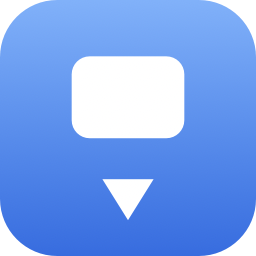
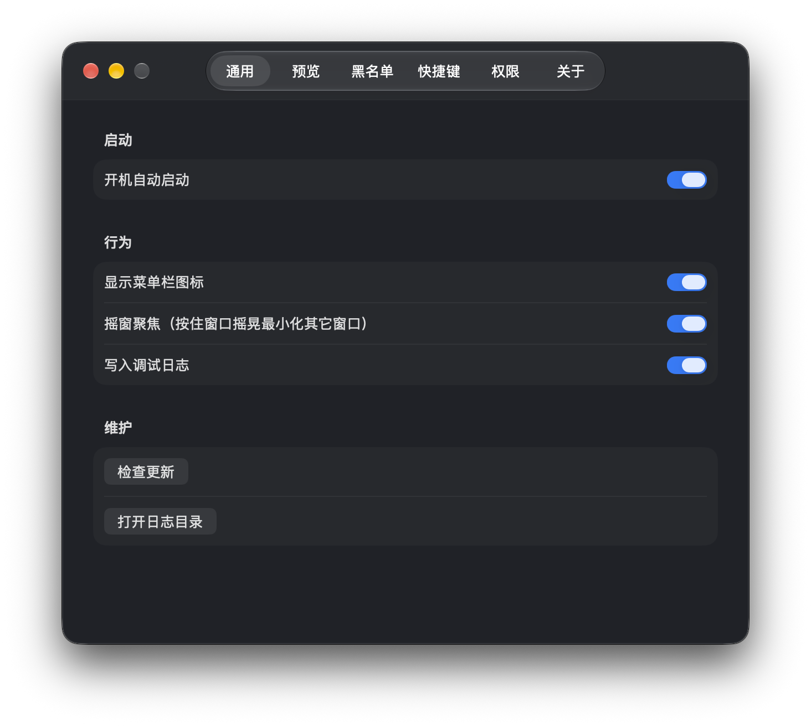
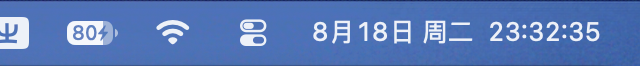
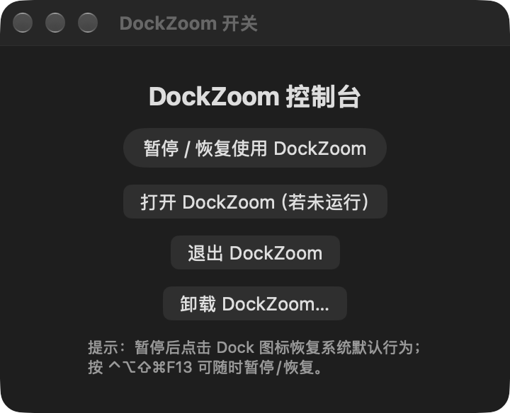

# DockZoom

macOS Dock 缩放/最小化增强工具（菜单栏应用）。

点击 Dock 图标 → 窗口带着**苹果原生 genie/scale 动画**缩进 Dock；再点一次 → 恢复。
适配所有应用，包括微信（WeChat）、Finder、Electron 无边框窗口等特殊应用。

## 功能

### 核心：点 Dock 图标最小化/恢复（保留原生动画）
- 点击**当前前台应用**的 Dock 图标 → 该应用所有可见窗口最小化到 Dock，动画为系统原生
  genie（神奇效果）或 scale（缩放效果，跟随「系统设置 → 桌面与程序坞」的选择）。
- 应用最小化后再次点击图标 → **全部找回**（恢复所有最小化窗口并激活，补上了
  GetBackMyWindows 缺失的通用恢复逻辑）。
- 应用隐藏时点击 → 恢复显示；后台应用点击 → 激活。
- 最小化失败自动降级链：`kAXMinimizedAttribute → kAXHidden → hide() → 合成⌘M`。

### 微信专属适配
- 主聊天窗口（标题「微信/WeChat」）与文章/小程序窗口（WeChatAppEx.app 辅助进程）分别处理。
- 过滤 280×380 搜索浮窗与 `kCGWindowSharingState==0` 僵尸窗口（微信/WPS 更新提示鬼影）。
- 恢复走手动 AX 序列（比系统 activate 更稳定，企业微信同理）。

### Finder 专属适配
- 永不 hide（桌面也是 Finder 窗口）；多窗口恢复优先 AppleScript
  （`set collapsed of every window to false`），AX 串行兜底。

### DockMinimize 功能对等
- 🖼️ **悬停预览**：鼠标悬停 Dock 图标弹出窗口缩略图条；点击缩略图最小化/恢复单个窗口
  （Windows 任务栏风格状态条）；鼠标离开 0.35s 自动收起（可设保持显示）。
- 🫨 **摇窗聚焦**：按住窗口横向摇晃 ≥3 次 → 最小化其它所有窗口；再摇 → 恢复。
- ⌨️ **全局快捷键**：为任意应用绑定快捷键（按一次唤出、再按一次隐藏）；
  内置**老板键**（默认 ⌃A）一键最小化所有窗口。
- 🚫 **黑名单**：贴边隐藏/会拦截点击的特殊软件加黑名单后完全跳过。
- ⚙️ **设置面板**：通用 / 预览 / 黑名单 / 快捷键 / 权限 / 关于。
- 开机自启（SMAppService）、菜单栏图标、日志、崩溃保护、
  EventTap 健康检查（30s）、防 App Nap、权限状态轮询。

## 界面概览

<p align="center">
  
</p>

**应用图标**（窗口落入 Dock 的意象）

| 设置面板 | 菜单栏 | DockZoom 开关 |
|---|---|---|
|  |  |  |

> 悬停预览、genie 最小化动画等动态效果建议直接下载体验：
> [Releases 下载](https://github.com/Namelessying/DockZoom/releases/latest)

## 技术要点

| 项 | 说明 |
|---|---|
| 原生动画 | `AXUIElementSetAttributeValue(kAXMinimizedAttribute)` 触发，动画由系统 Dock 播放（无独立 genie 私有 API，此为正解） |
| 点击检测 | CGEventTap（session + headInsert）+ Dock 图标 AX 缓存（3s 刷新）+ `AXUIElementCopyElementAtPosition` 兜底；10ms 决策保险箱 |
| Dock 适配 | 底部/左侧/右侧、自动隐藏、多显示器、放大效果（读 com.apple.dock 偏好，实时刷新） |
| 窗口枚举 | AX `kAXWindows` + `CGWindowList` 双通道合并；`_AXUIElementGetWindow` 关联 windowID |
| 缩略图 | 私有 `CGSHWCaptureWindowList`（可截最小化窗口），需屏幕录制权限 |
| 权限 | 辅助功能（必需）+ 屏幕录制（缩略图可选）；无沙盒；无需关 SIP |
| 构建 | 纯 swiftc（`scripts/build.sh`），无 Xcode 工程；`scripts/make-app.sh` 打包 .app |
| 系统要求 | macOS 13+（本机开发环境 macOS 27 / Xcode 26.6） |

## 构建与运行

```bash
./scripts/build.sh             # 调试构建
./scripts/build.sh release     # 发布构建
./scripts/make-app.sh release  # 打包 .build/DockZoom.app
open .build/DockZoom.app       # 运行
```

> 标准终端里也可以 `swift build`（SwiftPM，Package.swift 已提供）；
> 本项目开发环境受限，故另提供直接 swiftc 的构建脚本。

### 首次运行授权

1. 打开应用后按提示授予**辅助功能**权限（系统设置 → 隐私与安全性 → 辅助功能 → 勾选 DockZoom）。
2. 如需悬停缩略图预览，再授予**屏幕录制**权限。
3. 恢复 Finder 多窗口首次会弹「DockZoom 想要控制 Finder」，点允许。

### 建议测试清单

- [ ] 前台应用点 Dock 图标 → 带 genie 动画最小化；再点 → 恢复
- [ ] **微信**：聊天窗口点击最小化/恢复；打开文章后点图标回聊天；文章窗口独立最小化
- [ ] Finder：多窗口最小化后点击图标全部恢复
- [ ] 无边框/Electron 应用（如 VS Code 无边框、聊天工具）
- [ ] 悬停 Dock 图标 → 预览条出现；点缩略图最小化/恢复单窗口
- [ ] 摇窗聚焦；老板键 ⌃A；设置面板各项开关

## 项目结构

```
DockZoom/
├── Package.swift                       # SwiftPM 清单（标准环境用）
├── scripts/
│   ├── build.sh                        # swiftc 直接构建
│   └── make-app.sh                     # 打包 .app bundle
├── Support/Info.plist                  # LSUIElement 菜单栏应用
└── Sources/DockZoom/
    ├── main.swift                      # 入口
    ├── AppDelegate.swift               # 生命周期/权限/健康检查/崩溃保护
    ├── MenuBarController.swift         # 状态栏
    ├── DockEventMonitor.swift          # 点击监听 + 图标缓存 + 区域判定
    ├── HoverEventMonitor.swift         # 悬停监听
    ├── PreviewBarController.swift      # 悬停预览条（SwiftUI）
    ├── WindowManager.swift             # 核心：最小化/恢复/降级链/摇窗/老板键
    │   ├── FinderHandler               # Finder 特判
    │   └── WeChatHandler               # 微信特判
    ├── WindowThumbnailService.swift    # 窗口枚举/僵尸与浮窗过滤
    ├── ShakeMonitor.swift              # 摇窗手势检测
    ├── HotkeyManager.swift             # Carbon 全局热键
    ├── ScreenCaptureManager.swift      # 私有截图
    ├── SettingsManager.swift           # 偏好持久化/黑名单/老板键默认
    ├── SettingsWindowController.swift  # 设置面板（6 标签页）
    ├── AccessibilityManager.swift      # 权限
    ├── PrivateApis.swift               # CGS/SkyLight/Dock 位置/坐标
    ├── UpdateChecker.swift             # GitHub 更新检查（TODO: 替换仓库地址）
    └── DebugLogger.swift               # 文件日志（~/Library/Logs/DockZoom/）
```

## 参考项目与致谢

| 项目 | 借鉴内容 |
|---|---|
| [oidd/DockMinimize](https://github.com/oidd/DockMinimize) (MIT) | 整体架构、Dock 位置/放大适配、私有 API 声明、Finder 特判、健康检查 |
| [Avi7ii/GetBackMyWindows](https://github.com/Avi7ii/GetBackMyWindows) (MIT) | 微信适配方案（主窗口/文章窗口/辅助进程）、AX 点击命中 |
| [JackTonyMa/DockMinimizer](https://github.com/JackTonyMa/DockMinimizer) | Dock 图标 AX 枚举反查、权限真可用判定 |
| [ejbills/DockDoor](https://github.com/ejbills/DockDoor) | 私有 API 用法参考 |
| [lwouis/alt-tab-macos](https://github.com/lwouis/alt-tab-macos) | 最小化 API 与全屏窗口处理经验 |

## 已知限制与计划

- 原位预览/聚焦预览为计划功能（设置项已就位）。
- SideBar 联动是 DockMinimize 与其自家商业应用的私有协议，未移植。
- 自动隐藏 Dock 场景：首次点击用于唤出 Dock，点击图标本身仍可正常拦截。
- 更新检查仓库地址需替换为你的 GitHub 仓库。

## 仓库

- GitHub: https://github.com/Namelessying/DockZoom
- 下载: https://github.com/Namelessying/DockZoom/releases/latest
